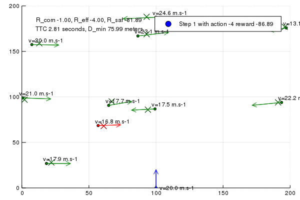

## Monte Carlo Tree Search with Reinforcement Learning for Motion Planning

This repo contains the code used in the paper "Monte Carlo Tree Search with Reinforcement Learning for Motion Planning", IEEE ITSC 2020

The following algorithms are implemented and benchmarked:
- **Rules-based (reflex) method**: a simple emergency braking method
- **Tree Search**: Uniform Cost Search (A*) and Dynamic Programming
- **MPC**: Model Predictive Control
- **Sampling based Tree Search with MCTS**: Monte Carlo Tree Search
- **DDQN**: Double Deep Q-learning using Deep Neural Networks
- **MCTS-NNET**: MCTS combined with DDQN. 


Ultimately we find that combining MCTS planning and DQN learning in a single solution provides the best performance with real-time decisions. Here, a pre-trained DQN network is used to guide the tree search, providing fast and reliable estimates of Q-values and state values. We call this model MCTS-NNET, as it leverages on the insights of AlphaGo Zero.  

Our results demonstrate the performance of MCTS-NNET achieving a 98% success rate when compared to a 84% success rate for DQN and a 85% success rate for MCTS alone. This is possible with an **inference time of 4 ms**.


## Julia source code (optimized for speed)  
The code was initially developped in Python and later on optimized for speed in Julia.  
The Julia versions are **much** faster than the Python versions.
* MDP model: [mdp.jl](https://github.com/PhilippeW83440/mcts-nnet/blob/master/julia/mdp.jl)
* Tests scenarios: [scn.jl](https://github.com/PhilippeW83440/mcts-nnet/blob/master/julia/scn.jl)
* UCS/A*, DP Tree Search: [search.jl](https://github.com/PhilippeW83440/mcts-nnet/blob/master/julia/search.jl)
* MPC: [mpc.jl](https://github.com/PhilippeW83440/mcts-nnet/blob/master/julia/mpc.jl)
* MCTS: [mcts.jl](https://github.com/PhilippeW83440/mcts-nnet/blob/master/julia/mcts.jl)

```bash
cd julia
julia scn.jl mcts
julia scn.jl mpc
julia scn.jl ucs
julia scn.jl dp
```


## Python source code  

Models and algorithms:  
* tree search model: [model.py](https://github.com/PhilippeW83440/mcts-nnet/blob/master/search/model.py)  
* mdp model: [mdp.py](https://github.com/PhilippeW83440/mcts-nnet/blob/master/mdp/mdp.py)  
* baseline (reflex-based): [baseline_agent.py](https://github.com/PhilippeW83440/mcts-nnet/blob/master/mdp/baseline_agent.py)  
* double dqn: [dqn_agent.py](https://github.com/PhilippeW83440/mcts-nnet/blob/master/mdp/dqn_agent.py)  
* dqn training: [train_dqn.py](https://github.com/PhilippeW83440/mcts-nnet/blob/master/mdp/train_dqn.py) 
* mcts and mcts-nnet: [mcts_agent.py](https://github.com/PhilippeW83440/mcts-nnet/blob/master/mdp/mcts_agent.py)  
* mpc: [mpc_agent.py](https://github.com/PhilippeW83440/mcts-nnet/blob/master/mdp/mpc_agent.py)  
* oracle (Uniform Cost Search and Dynamic Programming): [search.py](https://github.com/PhilippeW83440/mcts-nnet/blob/master/search/search.py)  
* value iteration: [vi.py](https://github.com/PhilippeW83440/mcts-nnet/blob/master/mdp/vi.py)  
  
  
Utilities used (from Stanford CS221 and CS230 courses):
* MDP utilities [util.py](https://github.com/PhilippeW83440/mcts-nnet/blob/master/mdp/util.py)   
* Pytorch Deep Learning utilities [utils_nn.py](https://github.com/PhilippeW83440/mcts-nnet/blob/master/mdp/utils_nn.py) 
* Priority Queue code [util.py](https://github.com/PhilippeW83440/mcts-nnet/blob/master/search/util.py) 


## Mcts-nnet inference

Baseline (reflex-based), dqn, mcts, mcts-nnet on 100 tests:

```bash
cd mdp
python3 test_algo.py --algo baseline
python3 test_algo.py --algo dqn
python3 test_algo.py --algo mcts
python3 test_algo.py --algo mpc
python3 test_algo.py --algo mcts-nnet
```

[//]: # (Image References)
[image1]: ./act.gif

<p align="center">
     
     <br>Collision Avoidance Scenario
</p>
  
  
## Mcts-nnet training

```bash
cd mdp
python3 train_dqn.py
```

Training results are stored in mdp/models  
Cf trained model [dnn-0.31.pth.tar](https://github.com/PhilippeW83440/mcts-nnet/blob/master/mdp/models/dnn-0.31.pth.tar)  

